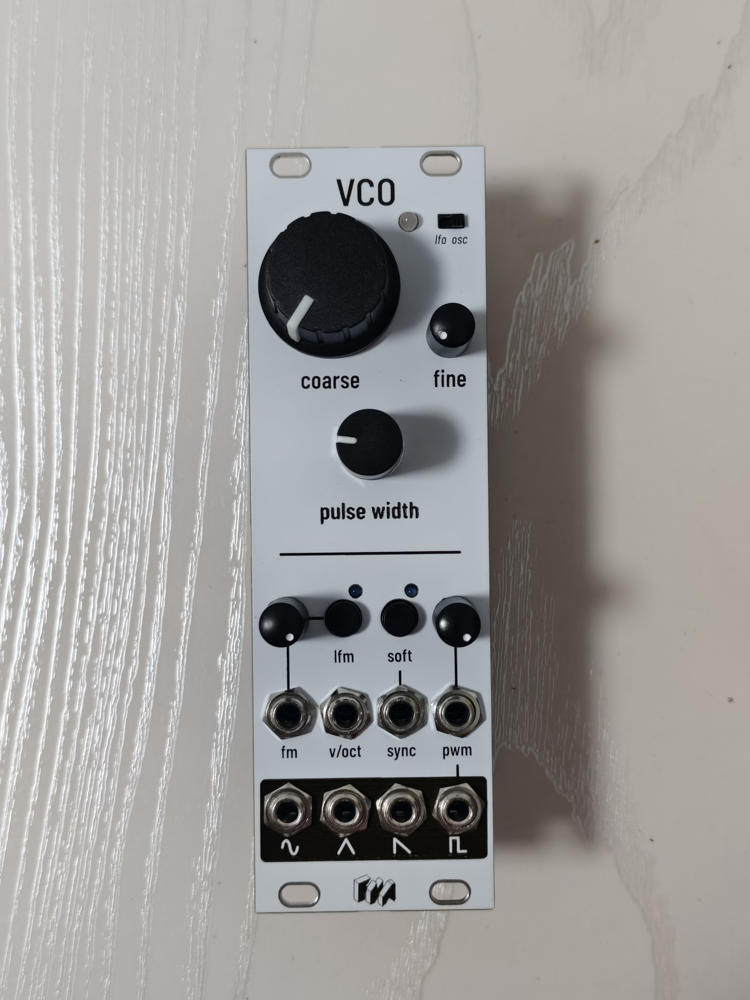

# VCO-SSI2131
A basic and generic VCO based on SSI2131

## Interface

### Main panel

| Name | Type | Description |
|:-----|:-----|:------------|
| `coarse`      | Potentiometer | 
| `fine`        | Potentiometer |
| `freq` LED    | Bi-color LED  | Voltage value for `tri`, green for positive voltage, red for negative voltage
| `pulse width` | Potentiometer | Almost full-range (0% ~ 100%) pulse width control of `pulse`
| `fm amt`      | Potentiometer | `fm` amount
| `pulse amt`   | Potentiometer | `pwm` amount
| `lfm`         | Switch button | FM type for `fm`, exponential (off) or linear (on)
| `lfm` LED     | LED           | Blue LED indicates if `lfm` switched on
| `soft`        | Switch button | Sync type for `sync`, hard (off) or soft (on)
| `soft` LED    | LED           | Blue LED indicates if `soft` switched on
| `lfo/osc`     | Toggle switch | Switch between oscillator mode and LFO mode

> *NOTICE: If `sync` input frequency to low, it may not trigger oscillator sync. Not guaranteed to solve this issue.*

### Fine-tuning

There are 3 rheostats on the PCB panel

| Name       | Description |
|:-----------|:------------|
| `VR_SCALE` | Adjust frequency range (scale) for SSI2131
| `VR_HFT`   | Adjust high frequency compensation for SSI2131's exponential converter
| `VR_SINE`  | Adjust sine shaper in tri-to-sine circuit 

## Specification

### Inputs

| Name    | Type    | Vmin | Vmax | Description |
|:--------|:--------|:------|:------|:------|
| `v/oct` | Input   | 0V    | +10V  |
| `fm`    | Input   | -5V   | +5V   | 
| `sync`  | Input   | -5V   | +5V   | Oscillator synchronization input, triggers on rising edge
| `pwm`   | Input   | -5V   | +5V   | Pulse width modulation, only apply for `pulse`

### Outputs
| Name    | Type    | Vmin | Vmax | Description |
|:--------|:--------|:------|:------|:------|
| `sine`  | Output  | -5V   | +5V   | Sine wave
| `tri`   | Output  | -5V   | +5V   | Triangle wave
| `saw`   | Output  | -5V   | +5V   | Downward sawtooth wave
| `pulse` | Output  | -5V   | +5V   | Pulse wave

### Physical dimension

- Height: 128.5mm (3U)
- Width: 40.3mm (8hp)
- Depth: 36mm

### Power consumption

- `+12V`: 38mA
- `-12V`: 24mA
- `+5V`: N/A

### Miscellaneous
#### About soft sync

> Soft sync synchronizes the SSI2131 to an external signal when the triangle waveform is falling and close to GND.
> A capacitively-coupled pulse on the SOFT SYNC input will cause the triangle to switch from falling to rising. If the voltage on TCAP is too high then synchronization will not take place.
> The synchronization is “soft” in that it only occurs within a narrow part of the oscillating cycle; at all other times it has no effect.
> 
> —— _From SSI2131 datasheet_

#### Design your panel

Blank panel design files in various file formats are provided.
Drill holes are filled in black, soldering mask are filled in grey.

Available file formats:
| Format | Software / Toolchain |
|:---------------|:------------------------|
| `.afdesign`    | Affinity Designer 2.6.5
| `.svg`, `.dxf` | Affinity Designer 2.6.5
| `.ai`          | Adobe Illustrator 2022

</img>

----------

FAREKIND VIRTUAL ASSETS, May 2025.
